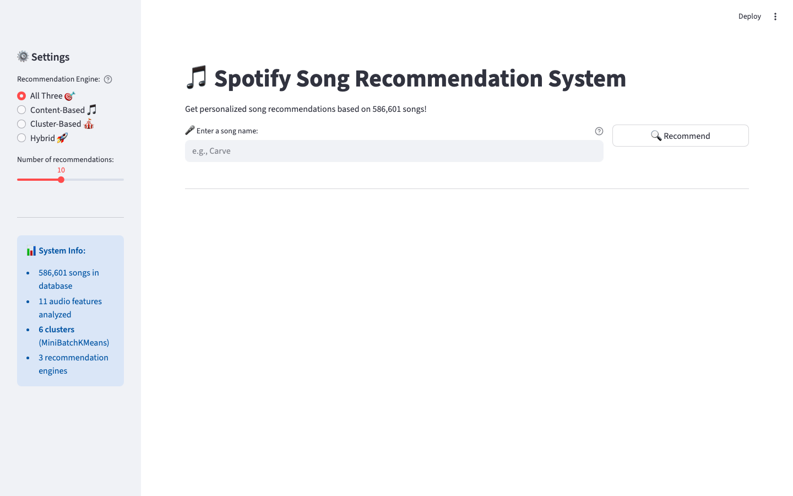
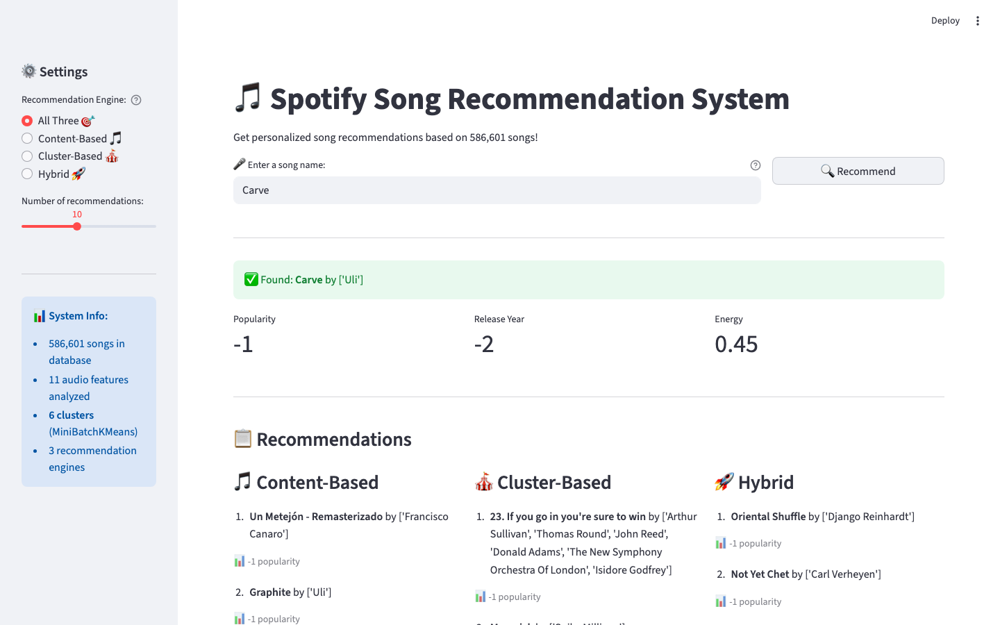

# 🎵 Spotify Song Recommendation System

## Brief Project Description

This project is a music recommendation system that suggests songs similar to a user’s input based on audio characteristics such as tempo, energy, and danceability. It uses machine learning to measure similarity between songs and provides recommendations through an interactive web interface.

---

## Team


| Name               | Expected Responsibilities                                |
| ------------------ | -------------------------------------------------------- |
| Ayush Khemani      | Project Co-Lead, Project Coordination, GitHub Management |
| Haseeb Raza        | Project Co-Lead, Technical Support, Team Coordination    |
| Nursultan Tuleev   | Build ML Recommendation Model                            |
| Muna Hassan        | Data Exploration, Cleaning, EDA                          |
| Saidul Islam Nayan | Build ML Recommendation Model                            |
| Yushay Aizaz       | Create Web Interface using Streamlit                     |


---

## The *Problem* behind the Project

With millions of songs available across platforms, users often struggle to discover music that matches their preferences or mood. Traditional browsing methods rely heavily on manual searching or popularity-based suggestions. This project aims to solve that problem by creating a content-based recommendation system that identifies songs with similar audio features and provides personalized suggestions automatically.

---

## Challenges

Some challenges involved in this project include:

- Handling a large dataset (600k+ songs)
- Cleaning and preprocessing real-world music data
- Selecting meaningful audio features for similarity computation
- Designing an efficient recommendation algorithm
- Integrating machine learning models with a web application
- Ensuring fast response time for recommendations

---

## Deliverables

The team delivered:

- A content-based music recommendation system with cluster-based and hybrid variants
- A feature pipeline and similarity/clustering logic suitable for ~586k+ tracks
- A Streamlit web interface to query recommendations interactively
- An end-to-end data science workflow (preprocessing notebooks, app, shared data artifacts)

---

## Tools & Technologies

The project uses the following tools and technologies:

- Python
- Pandas
- NumPy
- Scikit-learn
- Matplotlib / Plotly
- Streamlit
- Git & GitHub

---

## How to Run the Project

1. Clone the repository.
2. Install dependencies:

   ```bash
   pip install -r requirements.txt
   ```

3. Run the Streamlit app:

   ```bash
   streamlit run app/app.py
   ```

On first launch, the app can download preprocessed data files (`processed_spotify.csv`, `feature_matrix.npy`, `feature_names.txt`) from GitHub Releases if they are not already present under `data/`.

---

## Results

### System overview

- **Catalog:** ~586,601 songs after preprocessing.
- **Features:** 11 scaled inputs — danceability, energy, valence, acousticness, instrumentalness, liveness, speechiness, tempo, duration (ms), popularity, release year — stored as `feature_matrix.npy` with names in `data/feature_names.txt`.
- **Recommendation engines:**
  - **Content-based:** cosine similarity between the query song’s feature vector and all others (nearest neighbors in feature space).
  - **Cluster-based:** `MiniBatchKMeans` with **K = 6**; recommend random tracks from the same cluster (excluding the query).
  - **Hybrid:** take content-based candidates, then rank by **release year** (newer first) and **popularity** (higher first) for more usable lists.

### Application (screenshots)

Run `streamlit run app/app.py`, then search by **exact title** or **substring** (first match). Example query: **Carve**.

**Main screen — engine choice and search**



**Recommendations — all three engines side by side**

After clicking **Recommend**, the app shows the selected track’s popularity, release year, and energy, then lists suggestions for content-based, cluster-based, and hybrid modes.



### What we observed

- **Content-based** lists stay closest in feature space; **cluster-based** adds variety within a coarse group; **hybrid** surfaces newer, more popular picks among similar candidates.
- First load may download release assets into `data/`; `@st.cache_resource` keeps the feature matrix and dataframe in memory for faster repeats.

### Key learnings

- Scaling and caching matter when serving similarity search over hundreds of thousands of rows in a web UI.
- Combining **content similarity** with simple **popularity and recency** rules (hybrid mode) improves how recommendations feel without extra user data.
- Clear separation between offline preprocessing (notebooks, saved matrices) and the online app keeps iteration faster.

### Regenerating screenshots (optional)

With the app running on `http://127.0.0.1:8501`, install Playwright and run:

```bash
python3 -m pip install playwright
python3 -m playwright install chromium
python3 scripts/capture_app_screenshots.py
```

This writes PNGs under `docs/images/`.
